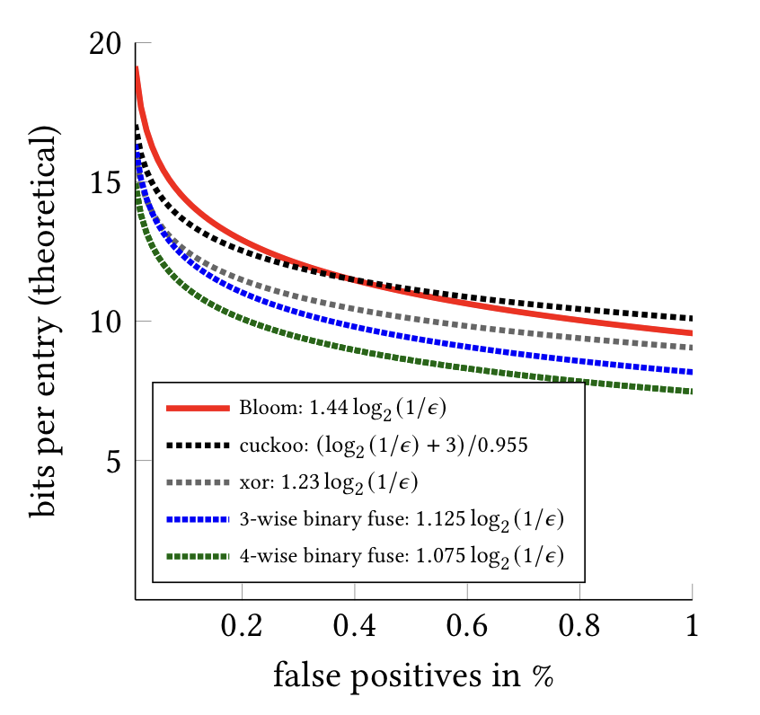

## Header-only Xor Filter library
[](https://travis-ci.org/FastFilter/xor_singleheader)

Bloom filters are used to quickly check whether an element is part of a set.
Xor filters are a faster and more concise alternative to Bloom filters.
They are also smaller than cuckoo filters.

Reference: [Xor Filters: Faster and Smaller Than Bloom and Cuckoo Filters](https://arxiv.org/abs/1912.08258), Journal of Experimental Algorithmics (to appear).




This is a simple C header-only library for Xor filters. It implements both xor8
and xor16.


Simply add the `xorfilter.h` file to your project.  It is made available under the
business-friendly Apache license.


For a simple application built on this library, see 
https://github.com/FastFilter/FilterPassword

We are assuming that your set is made of 64-bit integers. If you have strings
or other data structures, you need to hash them first to a 64-bit integer. It
is not important to have a good hash function, but collision should be unlikely
(~1/2^64).

You can use either the xor8 filter... (false-positive rate of about 0.3 %)

```C
uint64_t *big_set = ...
xor8_t filter;
xor8_allocate(size, &filter);
xor8_populate(big_set, size, &filter);
xor8_contain(big_set[0], &filter); // will be true
xor8_contain(somerandomvalue, &filter); // will be false with high probability

xor8_free(filter);
```

If the data is sizeable (e.g., 100,000,000 keys) and you have enough memory, you may want to replace  `xor8_populate` by `xor8_buffered_populate` for greater speed during construction.

Or the xor16 filter (larger but more accurate)... (vanishingly small false-positive rate)

```C
uint64_t *big_set = ...
xor16_t filter;
xor16_allocate(size, &filter);
xor16_populate(big_set, size, &filter);
xor16_contain(big_set[0], &filter); // will be true
xor16_contain(somerandomvalue, &filter); // will be false with high probability

xor16_free(filter);
```

If the data is sizeable (e.g., 100,000,000 keys) and you have enough memory, you may want to replace  `xor16_populate` by `xor16_buffered_populate` for greater speed during construction.


## C++ wrapper 

If you want a C++ version, you can  roll your own:

```C++
#include "xorfilter.h"

class Xor8 {
public:
    explicit Xor8(const size_t size) {
        if (!xor8_allocate(size, &filter)) {
            throw ::std::runtime_error("Allocation failed");
        }
    }
    ~XorSingle() {
        xor8_free(&filter);
    }
    bool AddAll(const uint64_t* data, const size_t start, const size_t end) {
        return xor8_buffered_populate(data + start, end - start, &filter);
    }
    inline bool Contain(uint64_t &item) const {
        return xor8_contain(item, &filter);
    }
    inline size_t SizeInBytes() const {
        return xor8_size_in_bytes(&filter);
    }
    Xor8(Xor8 && o) : filter(o.filter)  {
        o.filter.fingerprints = nullptr; // we take ownership for the data
    }
    xor8_s filter; 

private:
    Xor8(const Xor8 & o) = delete;
};
```


## Memory requirement

The construction of the filter needs a fair amount of memory: plan for about 64 bytes of memory per set entry. We support up to 4 billion entries, but you need to have the memory capacity. To support 4 billion entries, we recommend a computer with 256 GB of free memory. You can get around memory requirements by splitting off the set into smaller sets.

## Persistent usage

The data structure is quite simple: two 64-bit integer and an array of either 8-bit (for xor8)
or 16-bit (for xor16) integers. Thus you can easily save it to disk or memory-map it. E.g., we have

```C
typedef struct xor16_s {
  uint64_t seed;
  uint64_t blockLength;
  uint16_t
      *fingerprints; // points to 3*blockLength values
} xor16_t;
```

(We use a 64-bit blockLength variable, but the current code only supports 32-bit lengths, so blockLength stores an integer smaller than 1<<32. )


So, for example, you might be able to build an serialize the filter as follows:


```C
    xor8_t filter;
    xor8_allocate(array_size, &filter);
    xor8_buffered_populate(array, array_size, &filter);

    
    uint64_t seed = filter.seed;
    uint64_t BlockLength = filter.blockLength;

    FILE *write_ptr;
    write_ptr = fopen(outputfilename, "wb");
    fwrite(&seed, sizeof(seed), 1, write_ptr);
    fwrite(&BlockLength, sizeof(BlockLength), 1, write_ptr);
    fwrite(filter.fingerprints, sizeof(uint8_t) * 3 * BlockLength, 1,
                   write_ptr);
    fclose(write_ptr);
```

Then you might be able to use memory-file mapping to query it...


```C
    xor8_t filter;
    filter.seed = seed;
    filter.blockLength = BlockLength;

    uint64_t seed = 0;
    uint64_t BlockLength = 0;
    fread(&seed, sizeof(seed), 1, fp);
    fread(&BlockLength, sizeof(BlockLength), 1, fp) ;
    FILE *fp = fopen(filename, "rb");
    int fd = open(filename, O_RDONLY);

    uint8_t *addr =
      (uint8_t *)(mmap(NULL, length, PROT_READ,
                       MAP_FILE | (shared ? MAP_SHARED : MAP_PRIVATE), fd, 0));
    filter.fingerprints = addr + 3 * sizeof(uint64_t);
    if (xor8_contain(hexval, &filter)) {
      printf("Probably in the set.\n");
    } else {
      printf("Surely not in the set.\n");
    }
```


## Running tests and benchmarks

To run tests: `make test`.


```
$ make test
$ ./unit
testing buffered xor8
fpp 0.0039209000 (estimated)
bits per entry 9.9
testing buffered xor16
fpp 0.0000153000 (estimated)
bits per entry 19.7
testing xor8
fpp 0.0039452000 (estimated)
bits per entry 9.9
testing xor16
fpp 0.0000145000 (estimated)
bits per entry 19.7
```

To run construction benchmarks:
```
$ make bench
$ ./bench

testing buffered xor8 size = 100000000
It took 14.915994 seconds to build an index over 100000000 values.
testing xor8 size = 100000000
It took 19.102584 seconds to build an index over 100000000 values.
testing buffered xor16 size = 100000000
It took 15.234039 seconds to build an index over 100000000 values.
testing xor16 size = 100000000
It took 19.373102 seconds to build an index over 100000000 values.
```
